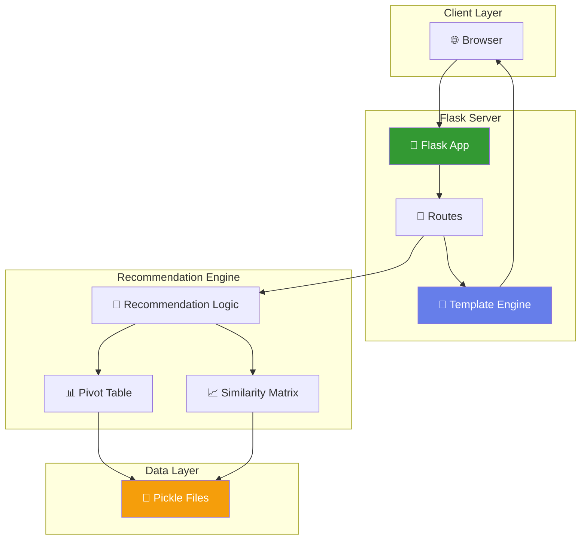
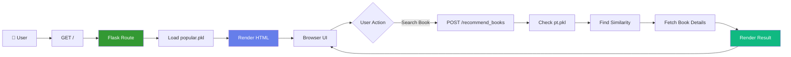
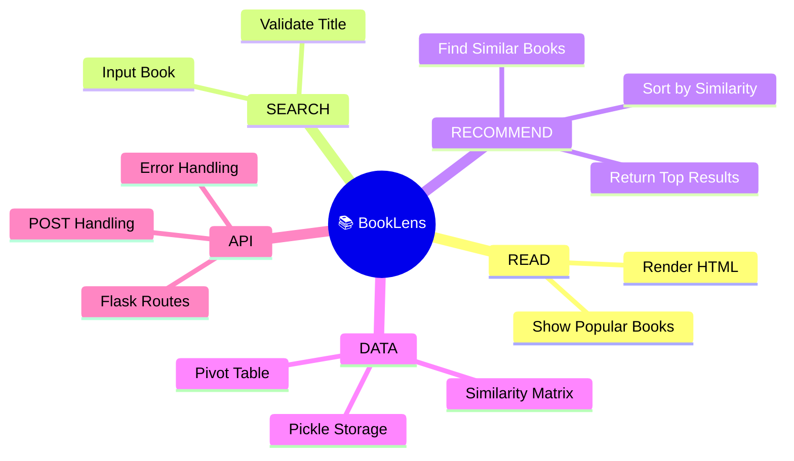
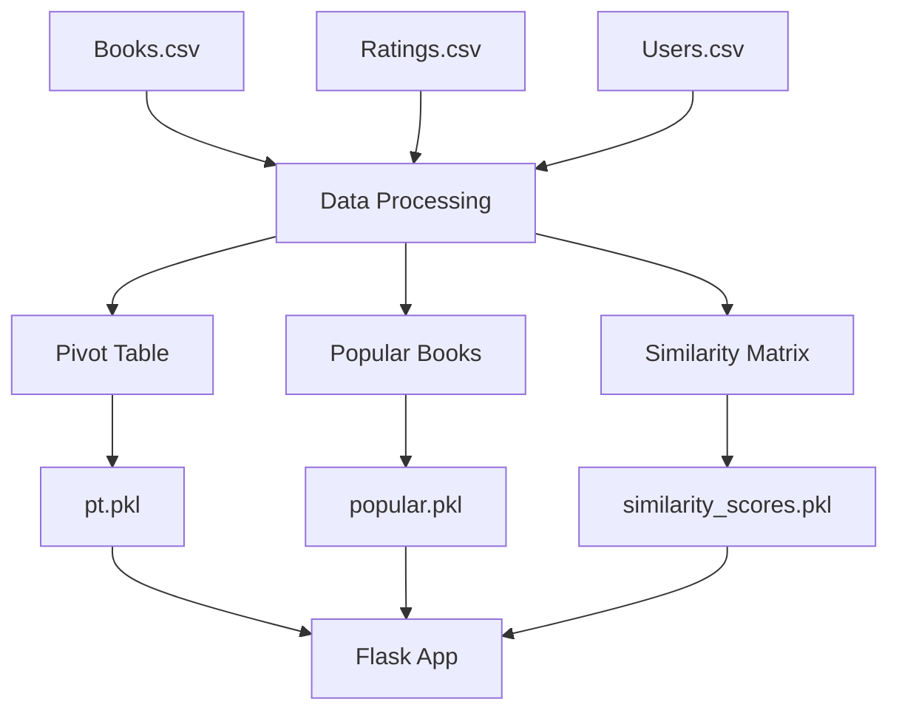

--

# 📚 BookLens – Book Recommendation System

#### #  In Short #

BookLens is a Flask-based web application that recommends books using #item-based collaborative filtering# and #cosine similarity#.

Users can:

* View #Top 50 Popular Books#
* Get #similar book recommendations# based on user ratings

The system uses #preprocessed pickle files#, ensuring fast performance without reprocessing large datasets.

---

####  BAse FOundation

* Recommendation technique: #Collaborative Filtering#
* Similarity metric: #Cosine Similarity#
* Data processing: Done offline in Jupyter Notebook
* Runtime: Uses `.pkl` files for fast inference 

---

# Tech Stack#

* Backend: Flask
* Data: pandas, NumPy
* Deployment: gunicorn
* Frontend: HTML (Jinja templating)

---

#### # Project Structure#

```
Book Recommendation/
│
├── frontend/
│   ├── app.py
│   ├── index.html
│   ├── recommend.html
│   ├── popular.pkl
│   ├── pt.pkl
│   ├── books.pkl
│   ├── similarity_scores.pkl
│
├── Books.csv
├── Ratings.csv
├── Users.csv
├── book-recommender-system.ipynb
├── requirements.txt
└── Procfile
```

---

#### # Run Locally#

```bash
py frontend\app.py
```

Open:

```
http://127.0.0.1:5000/
```

---

#### 🔁 System Architecture Flow



---

### # Application Flow (ASCII)#

```
┌───────────────────────────────────────────────┐
│               APPLICATION FLOW                │
├───────────────────────────────────────────────┤
│                                               │
│  Client → Flask → Routes → Logic → Data       │
│     ↑                              ↓          │
│  HTML Render  ← Template Engine ← Result      │
│                                               │
└───────────────────────────────────────────────┘
```

---

###                #                   🌐 Request Lifecycle #



---

### # CRUD-like Flow (Mindmap)#



---

### # Recommendation Logic#

```
User Input
    ↓
Find Index in pt.pkl
    ↓
Read similarity_scores
    ↓
Sort by similarity
    ↓
Skip same book
    ↓
Return Top 4 books
```

---

### # Data Pipeline#



---

### # Limitations#

* Only works for books in dataset
* No real-time learning
* No content-based filtering
* Static recommendations

---

### # Key Takeaways#

* Fast runtime using #pickle files#
* Scalable architecture (separate training + serving)
* Clean separation:

  * Data Processing (Notebook)
  * Backend (Flask)
  * Frontend (HTML)

---

### # Summary#

BookLens transforms raw rating data into a #real-time recommendation system# by:

* Precomputing similarity
* Serving via Flask
* Rendering dynamic HTML

---


---


